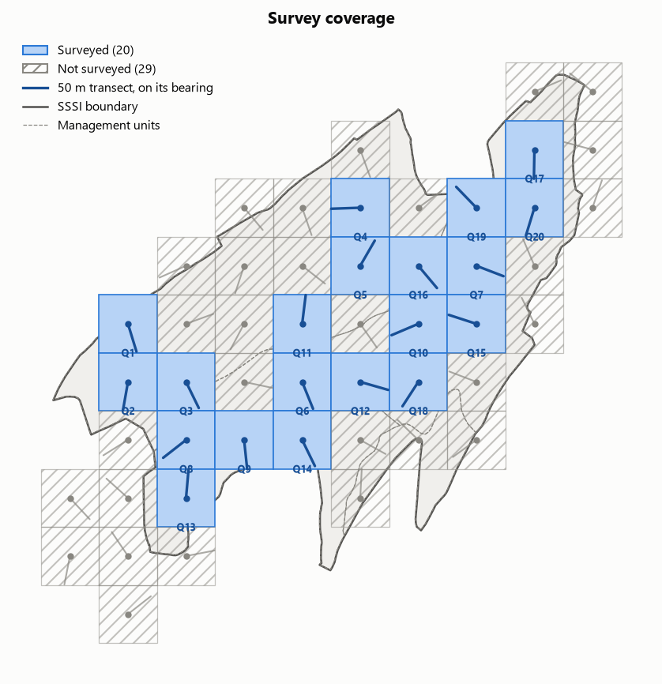
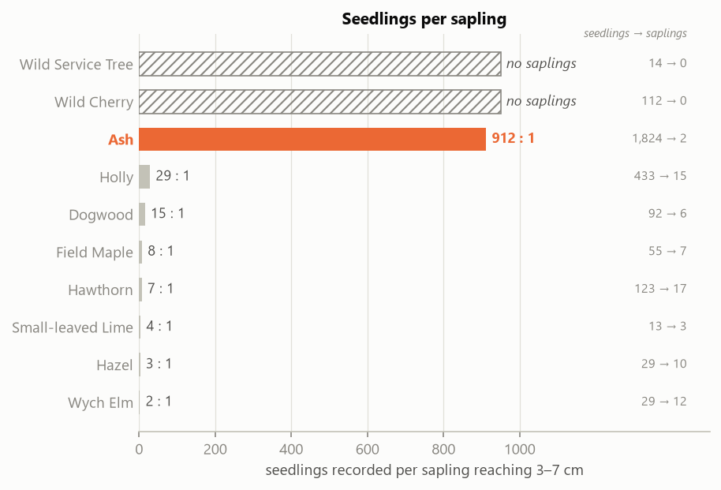
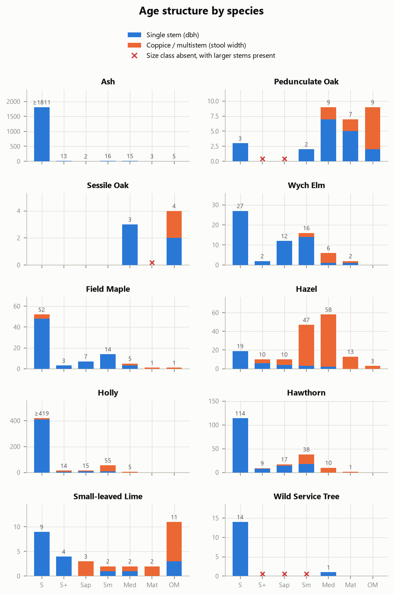
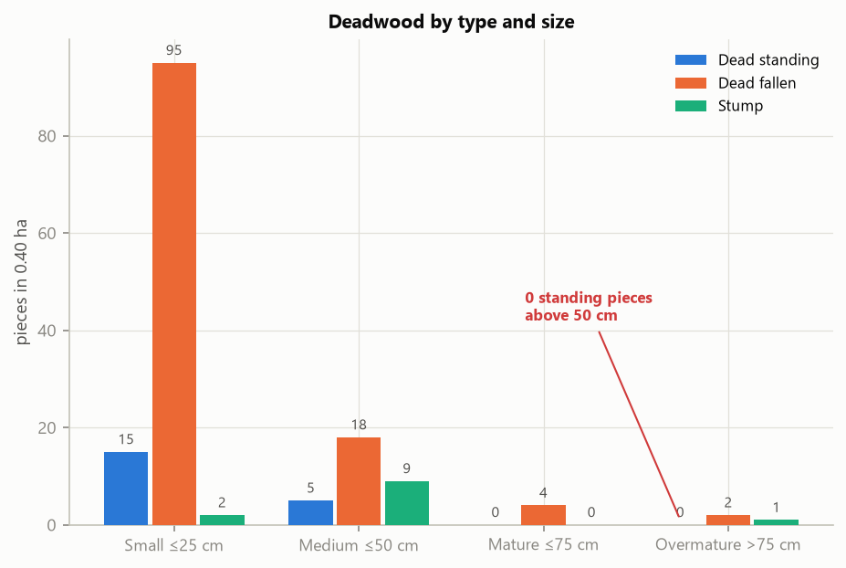
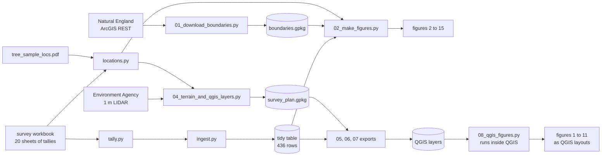

# Weston Big Wood SSSI: Initial Tree Survey Analysis

Initial GIS and statistical analysis of Avon Wildlife Trust's 2022 tree survey
of Weston Big Wood SSSI, an ancient limestone woodland near Portishead, North
Somerset. A scripted Python pipeline turns 20 hand-tallied field sheets into
density, diversity and deadwood maps, and an evidence base for the site's
statutory condition assessment. A parallel PyQGIS pipeline rebuilds the same
maps as QGIS print layouts.

**Author:** Kaspar Szpojnarowicz
**Client:** Avon Wildlife Trust (volunteer GIS and data analysis)
**Status:** Initial analysis. 20 of 49 planned transects were walked, so this
is a first pass built to be rerun when more fieldwork is done.

| | |
|---|---|
| Survey | 12 May to 6 October 2022 |
| Coverage | 20 of 49 planned transects, 0.40 ha of 37.66 ha (1.06%) |
| Records | 436 tidy rows, 30 species, 3,218 live stems |
| Outputs | 15 figures (14 matplotlib, 11 QGIS, figure 1 QGIS only) |
| Tests | 26, on the tally parser |

## Project Overview

Weston Big Wood is 37.66 ha of ancient woodland notified as a Site of Special
Scientific Interest in 1971, for its open-canopy oak standards, coppice and
maiden ash, rich ground flora, and two ancient woodland indicator trees the
1984 citation calls "locally abundant": Small-leaved Lime and Wild Service
Tree. In April 2023 Natural England assessed all four management units as
**Unfavourable, Declining**, citing ash dieback and insufficient standing
deadwood.

In 2022 AWT surveyed the wood on a 100 m grid: 49 planned belt transects
(50 m x 4 m, random bearings), of which 20 were walked, recording every stem
by species, size class and stem type (single, coppice, multistem), plus
standing and fallen deadwood. The data sat unanalysed until this project.



*Figure 2. Survey coverage: 20 of 49 planned transects walked. A LIDAR check
(EA 1 m DTM) shows the unwalked squares are no steeper on average than the
walked ones, but are five times as likely to contain a cliff face (max slope
over 60 degrees: 8 of 29, against 1 of 20 surveyed). Terrain explains only
part of the gap. On every map in this repo, blank means not surveyed, never
zero.*

Each output the client asked for happens to test a stated reason the site is
failing, so the figures are arranged as evidence for the condition
conversation rather than as a generic mapping exercise.

## Key Findings

**Ash converts seedlings to saplings at 912:1.** Every other species in the
wood converts at between 2:1 and 29:1. Ash masts, so a large seedling crop and
heavy losses are expected, but a gap of three orders of magnitude against wych
elm on the same soil looks like dieback rather than masting. A single snapshot
with no control site cannot prove cause.



*Figure 13. Seedling to sapling conversion by species. Ash highlighted; its
seedling total is a censored minimum (field cap of 100 per cell).*

**The wood has no next generation of canopy trees.** There is not a single oak
sapling in the survey, in a wood notified for its oak. The successor cohort
(7 to 50 cm, single stems) is led by ash and wych elm, the two species under
active disease pressure.



*Figure 12. Age classes split by species. Single stems (measured by dbh) are
separated from coppice and multistem (measured by stool width): the two share
recording columns but are different measurements, and pooling them roughly
triples apparent canopy density.*

**Standing deadwood stops entirely at 50 cm.** Total deadwood is not scarce
(151 pieces in 0.40 ha), but zero standing pieces exceed 50 cm anywhere in the
survey. The failure is size and posture, not quantity, which refines the
regulator's judgement into a cheap management action: retain dead stems
standing where safety allows.



*Figure 15. Deadwood by type and size class.*

**The 1984 citation no longer describes this wood.** The survey found one
established Wild Service Tree, and 17 established Small-leaved Limes of which
11 are in the largest size class. Lime shows a bimodal age structure: eleven
overmature stems, thirteen seedlings, and only nine stems across everything in
between. Both species are cited as "locally abundant" in the site's legal
designation.

Other results: a fourfold density spread (450 to 1,800 established stems/ha,
site mean 988); Shannon diversity 0.66 to 1.90 with the poorest cells
hazel-dominated abandoned coppice; non-native trees at 0.5% of stems, though
all eight sycamore are seedling to small and Natural England record sycamore
at 30% of large trees in the same corner, so the survey undercounts it; and no
transect at all in management unit 3, which is the quarry.

All figures are in [`outputs/figures/`](outputs/figures/), with the full
figure list in [`docs/figures.md`](docs/figures.md).

## The Pipeline



The design rule: **everything in `src/wbw/` reads and calculates but never
writes a file; everything in `scripts/` writes files but parses nothing.** One
workbook reader feeds the figures, the QGIS exports and the unit summary, so a
parsing fix happens in one place.

## Repository Structure

```
├── src/wbw/                    the analysis package (installed via pip -e)
│   ├── config.py               paths, CRS, transect geometry, documented data repairs
│   ├── tally.py                parser for the field tally notation
│   ├── ingest.py               workbook -> tidy table (one row per transect/species/class)
│   ├── locations.py            transect coordinates + the 49-point sample plan
│   └── naturalengland.py       boundary downloads from the NE open data API
├── scripts/
│   ├── 01_download_boundaries.py   SSSI boundary, management units, Ancient Woodland
│   ├── 02_make_figures.py          figures 2 to 15, matplotlib
│   ├── 03_build_report.py          self-contained HTML report
│   ├── 04_terrain_and_qgis_layers.py  LIDAR slope, cliff flags, survey_plan.gpkg
│   ├── 05_export_qgis_results.py   every metric per survey square
│   ├── 06_export_unit_summary.py   the four management units with results attached
│   ├── 07_export_non_natives.py    non-native records as species-level points
│   └── 08_qgis_figures.py          figures 1 to 11 as QGIS layouts (run inside QGIS)
├── tests/                      pytest suite for the tally parser
├── docs/
│   ├── figures.md              full figure list, both toolchains
│   └── qgis-figures.md         the QGIS gallery
├── data/
│   ├── raw/                    AWT survey workbook + field documents (NOT in repo)
│   ├── external/               downloaded and derived layers (regenerated)
│   └── processed/              intermediates (regenerated)
├── outputs/
│   ├── figures/                matplotlib figures 2 to 15
│   │   └── qgis/               QGIS figures 1 to 11
│   └── tables/                 per-unit summary, headline stats
├── wbw_figures.qgz             the QGIS project, rebuilt by script 08
└── *.md                        brief, data audit, site dossier, pre-analysis findings,
                                GIS data sources, NE condition assessment
```

## How to Run

```bash
python -m venv .venv
.venv/Scripts/activate            # Windows; on macOS/Linux: source .venv/bin/activate
pip install -e ".[dev]"

python -m pytest                  # 26 tests on the tally parser
```

**The script numbers are not the run order.** Boundaries must exist before the
figures can be drawn, and the survey plan before the unit summary uses it:

```bash
python scripts/01_download_boundaries.py      # -> boundaries.gpkg
python scripts/04_terrain_and_qgis_layers.py  # needs dtm_1m.tif -> survey_plan.gpkg
python scripts/02_make_figures.py             # -> figures 2 to 15
python scripts/05_export_qgis_results.py      # -> survey_results.gpkg
python scripts/06_export_unit_summary.py      # -> management_units.gpkg
python scripts/07_export_non_natives.py       # -> non_natives.gpkg
python scripts/03_build_report.py             # -> outputs/report.html
```

Requires the survey workbook in `data/raw/` (not distributed, see below), and
the EA 1 m DTM tile as `data/external/dtm_1m.tif` for script 04.
Python 3.12+. Stack: pandas, geopandas, shapely, pyproj, matplotlib, openpyxl,
pypdf.

## QGIS

Figures 1 to 11 are also built as QGIS print layouts by
[`scripts/08_qgis_figures.py`](scripts/08_qgis_figures.py), which runs inside
the QGIS Python environment rather than the project venv. It is idempotent: a
previous run is torn down first, so it can be rerun after an edit without
duplicating layers or layouts.

**[See the QGIS gallery](docs/qgis-figures.md)**

Figure 1 exists only in QGIS, because it needs a basemap. Figures 12 to 15 are
statistical charts with no geometry and stay in matplotlib. Figures 4, 6 and 8
use IDW in QGIS against Gaussian kernel smoothing in Python, so the two
surfaces are related but not identical and must not be presented as the same
figure.

## Data and Licensing

- **Survey data** is (c) Avon Wildlife Trust, unpublished, and is not included
  in this repository. `data/raw/` is permanently gitignored so it cannot enter
  git history.
- **Boundaries**: Natural England open data (SSSI boundaries, SSSI management
  units, Ancient Woodland Inventory), Open Government Licence v3.0.
- **Terrain**: Environment Agency LIDAR composite DTM, Open Government
  Licence v3.0.
- All spatial work is in OSGB36 / British National Grid (EPSG:27700). Nothing
  is reprojected, because Natural England publish in the same CRS.
- **Code** is MIT licensed.

## Analytical Honesty Notes

Five decisions worth knowing before reusing anything here:

1. **Stem types are split for structural analysis.** Coppice and multistem are
   measured by stool width, single stems by dbh; they share recording columns
   but are not comparable, so no structural figure pools them.
2. **Seedling counts are censored.** Field protocol capped counts at 100 per
   cell (">100"). All seedling figures are minima and are never folded into
   density maps.
3. **Maps are gridded, not interpolated.** 20 points covering 1.06% of the
   site support per-cell comparison, not a smooth surface. The interpolated
   figures are labelled indicative and show their support points.
4. **Size classes are read by column position, not header label.** The labels
   drift between sheets; the positions do not.
5. **Two grid references were repaired in code, never in the data.** Q5 and
   Q11 lost a leading digit and plot 300 km offshore uncorrected. The repair
   lives in `config.py` with its justification and is reported on every run.

The one notation ambiguity in the brief (whether `2, C, 2M` means 2 or 3
single stems) was **resolved by the client on 14 August 2026 as 2**, which is
the reading the parser already used, so no counts changed.
