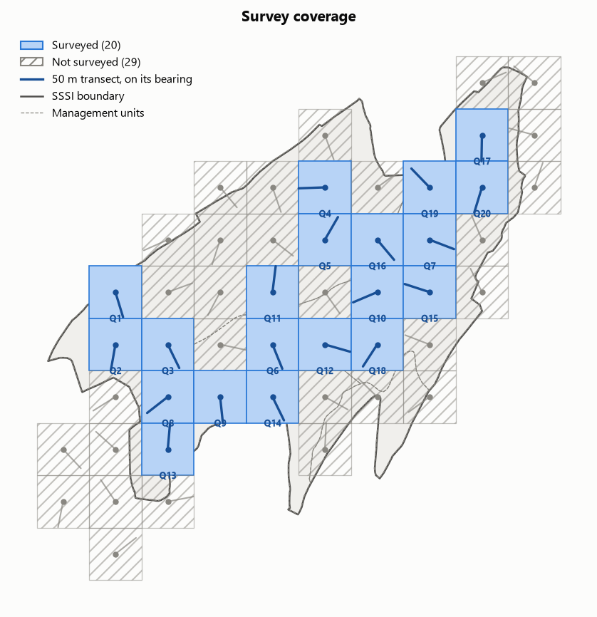
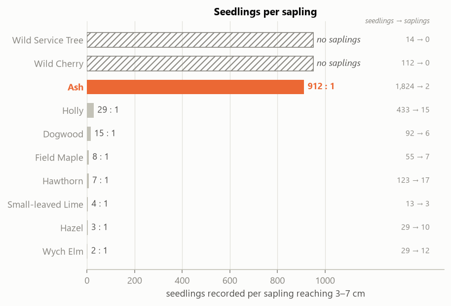
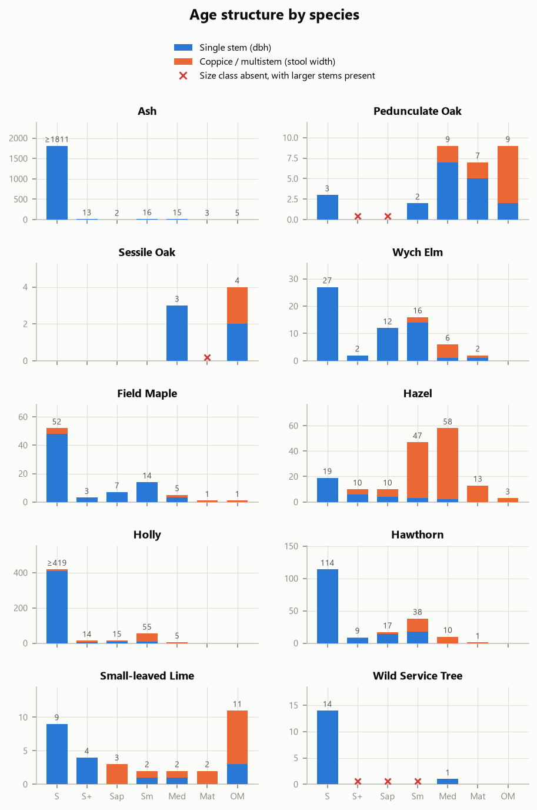
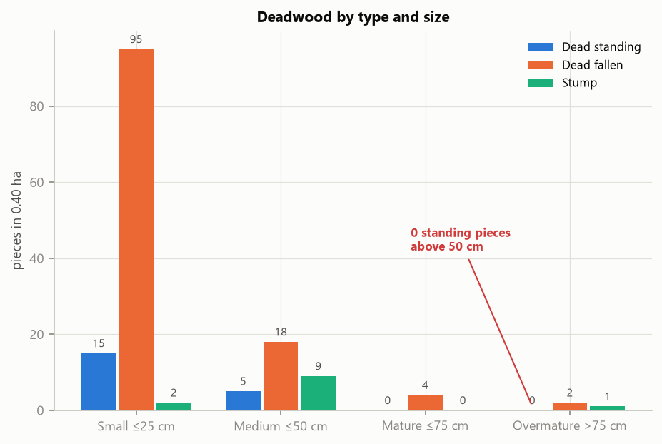
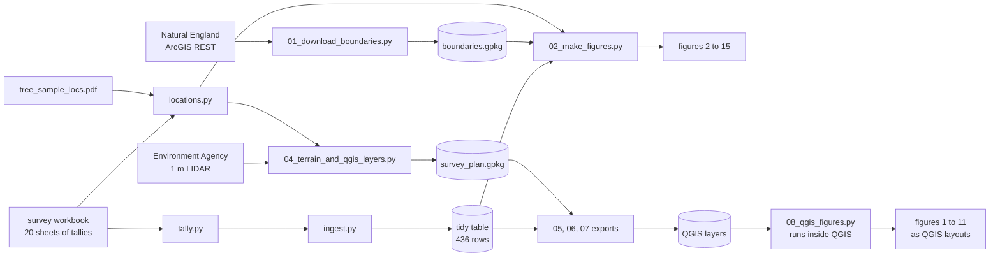

# Weston Big Wood SSSI: Tree Survey Analysis

I volunteer with Avon Wildlife Trust (AWT) as a GIS and data analyst. This repo
analyses AWT's 2022 tree survey of Weston Big Wood SSSI, an ancient limestone
woodland near Portishead, North Somerset.

Python scripts turn 20 hand-tallied field sheets into maps of tree density,
diversity and deadwood. A separate script rebuilds the maps as QGIS print
layouts.

**Author:** Kaspar Szpojnarowicz
**Status:** First pass. Surveyors walked 20 of 49 planned transects, so I built
the pipeline to rerun when more fieldwork comes in.

| | |
|---|---|
| Survey | 12 May to 6 October 2022 |
| Coverage | 20 of 49 planned transects, 0.40 ha of 37.66 ha (1.06%) |
| Records | 436 tidy rows, 30 species, 3,218 live stems |
| Outputs | 15 figures: 2 to 15 in matplotlib, 1 to 11 in QGIS |
| Stack | Python (pandas, geopandas, matplotlib), PyQGIS |
| Tests | 26, on the tally parser |

## Project Overview

Weston Big Wood covers 37.66 ha. It became an SSSI in 1971 for its oak
standards, coppice, ash, ground flora, and two ancient woodland indicator trees
that the 1984 citation calls "locally abundant": Small-leaved Lime and Wild
Service Tree. In April 2023 Natural England rated all four management units
**Unfavourable, Declining**, citing ash dieback and too little standing
deadwood.

In 2022 AWT laid out 49 belt transects (50 m x 4 m) on a 100 m grid, each on a
random bearing. Surveyors walked 20 of them and recorded every stem by species,
size class and stem type (single, coppice or multistem), plus standing and
fallen deadwood. Nobody had analysed the data before this project.



*Figure 2. Survey coverage. A LIDAR check (EA 1 m DTM) shows the unwalked
squares are no steeper on average than the walked ones, but they are five times
as likely to contain a cliff (max slope over 60 degrees in 8 of 29, against 1
of 20 walked). Terrain explains some of the gap. On every map here, blank
squares mean no data.*

I arranged the figures around Natural England's reasons for the poor rating:
ash dieback, deadwood, and whether the cited species are still there.

## Key Findings

**Ash: 912 seedlings for every sapling.** Other species range from 2:1 to 29:1.
Ash seeds heavily in mast years, so some loss is normal, but 912:1 is over 400
times wych elm's 2:1 on the same soil. That points to dieback. One survey with
no control site can't prove it.



*Figure 13. Seedlings per sapling by species. Ash is highlighted. Its seedling
total is a minimum, because the field sheet capped counts at 100 per cell.*

**No young oaks.** The survey found no oak saplings at all, in a wood
designated for its oak. Ash and wych elm lead the next generation of canopy
trees (single stems, 7 to 50 cm), and disease threatens both.



*Figure 12. Age classes by species. Surveyors measured single stems by dbh and
coppice or multistem by stool width. The field sheet records both in the same
columns, so I kept them apart: pooling them roughly triples apparent canopy
density.*

**No standing deadwood over 50 cm.** The survey found plenty of deadwood (151
pieces in 0.40 ha), but no standing piece exceeds 50 cm. That suggests a cheap
fix: leave dead trees standing where it's safe.



*Figure 15. Deadwood by type and size class.*

**The 1984 citation is out of date.** It lists both indicator trees as "locally
abundant". The survey found one established Wild Service Tree, and 17
established Small-leaved Limes, 11 of them in the largest size class. Lime has
a gap in its age structure: 11 overmature stems, 13 seedlings, and only 9 stems
in between.

Other results:

- Established stem density varies fourfold, from 450 to 1,800 stems/ha (site
  mean 988).
- Shannon diversity runs from 0.66 to 1.90. Abandoned hazel coppice scores
  lowest.
- Non-native trees make up 0.5% of stems. All eight sycamores are seedlings or
  small trees, yet Natural England recorded sycamore as 30% of large trees in
  the same corner, so the survey undercounts it.
- No transect falls in management unit 3, the quarry.

All figures are in [`outputs/figures/`](outputs/figures/), listed in
[`docs/figures.md`](docs/figures.md).

## The Pipeline


```mermaid
flowchart LR
  XL["survey workbook<br/>20 sheets of tallies"] --> TAL["tally.py"]
  TAL --> ING["ingest.py"]
  ING --> TIDY[("tidy table<br/>436 rows")]

  XL --> LOC["locations.py"]
  PDF["tree_sample_locs.pdf"] --> LOC

  NE["Natural England<br/>ArcGIS REST"] --> S01["01_download_boundaries.py"]
  S01 --> BND[("boundaries.gpkg")]

  EA["Environment Agency<br/>1 m LIDAR"] --> S04["04_terrain_and_qgis_layers.py"]
  LOC --> S04
  S04 --> PLAN[("survey_plan.gpkg")]

  TIDY --> S02["02_make_figures.py"]
  BND --> S02
  LOC --> S02
  S02 --> FIG["figures 2 to 15"]

  TIDY --> EXP["05, 06, 07 exports"]
  PLAN --> EXP
  EXP --> GPK[("QGIS layers")]

  GPK --> S08["08_qgis_figures.py<br/>runs inside QGIS"]
  S08 --> QFIG["figures 1 to 11<br/>as QGIS layouts"]
```

Code in `src/wbw/` reads and calculates but never writes files. Code in
`scripts/` writes files but does no parsing. One workbook reader feeds
everything, so I fix parsing bugs in one place.

## Repository Structure

```
├── src/wbw/                    the analysis package (installed via pip -e)
│   ├── config.py               paths, CRS, transect geometry, documented data repairs
│   ├── tally.py                parser for the field tally notation
│   ├── ingest.py               workbook -> tidy table (one row per transect/species/class)
│   ├── locations.py            transect coordinates + the 49-point sample plan
│   └── naturalengland.py       boundary downloads from the NE open data API
├── scripts/
│   ├── 01_download_boundaries.py   SSSI boundary, management units, Ancient Woodland
│   ├── 02_make_figures.py          figures 2 to 15, matplotlib
│   ├── 03_build_report.py          self-contained HTML report
│   ├── 04_terrain_and_qgis_layers.py  LIDAR slope, cliff flags, survey_plan.gpkg
│   ├── 05_export_qgis_results.py   every metric per survey square
│   ├── 06_export_unit_summary.py   the four management units with results attached
│   ├── 07_export_non_natives.py    non-native records as species-level points
│   └── 08_qgis_figures.py          figures 1 to 11 as QGIS layouts (run inside QGIS)
├── tests/                      pytest suite for the tally parser
├── docs/
│   ├── figures.md              full figure list, both toolchains
│   └── qgis-figures.md         the QGIS gallery
├── data/
│   ├── raw/                    AWT survey workbook + field documents (not in repo)
│   ├── external/               downloaded and derived layers (regenerated)
│   └── processed/              intermediates (regenerated)
├── outputs/
│   ├── figures/                matplotlib figures 2 to 15
│   │   └── qgis/               QGIS figures 1 to 11
│   └── tables/                 per-unit summary, headline stats
├── wbw_figures.qgz             the QGIS project, rebuilt by script 08
├── WBW_survey_report.pdf       the report delivered to AWT
└── *.md                        brief, data audit, site dossier, pre-analysis findings,
                                GIS data sources, NE condition assessment
```

## How to Run

You need Python 3.12+, AWT's survey workbook and an Environment Agency LIDAR
tile. Neither data file is in this repo.

**1. Set up**

```bash
python -m venv .venv
source .venv/Scripts/activate     # Windows Git Bash
# .venv\Scripts\Activate.ps1      # Windows PowerShell
# source .venv/bin/activate       # macOS / Linux
pip install -e ".[dev]"
python -m pytest                  # 26 tests on the tally parser
```

**2. Add the data**

- Put `WBW_tree_age_distributions_tallied.xlsx` and `tree_sample_locs.pdf` in
  `data/raw/`. Both belong to AWT and aren't public.
- Download the EA LIDAR Composite DTM 1 m for 345000 to 346150 E, 174500 to
  175600 N (British National Grid) from the EA WCS service, and save it as
  `data/external/dtm_1m.tif`. Only script 04 needs it. Section 4 of
  [`gis_data_sources.md`](gis_data_sources.md) has the endpoint.

**3. Run the scripts in number order**

```bash
python scripts/01_download_boundaries.py      # Natural England layers (needs internet)
python scripts/02_make_figures.py             # figures 2 to 15, unit summary, headline stats
python scripts/03_build_report.py             # outputs/report.html
python scripts/04_terrain_and_qgis_layers.py  # LIDAR slope -> survey_plan.gpkg
python scripts/05_export_qgis_results.py      # -> survey_results.gpkg
python scripts/06_export_unit_summary.py      # -> management_units.gpkg
python scripts/07_export_non_natives.py       # -> non_natives.gpkg
```

**4. QGIS figures (optional)**

Run steps 1 to 3 first. In QGIS, open Plugins > Python Console, click Show
Editor, open `scripts/08_qgis_figures.py` and run it. It writes PNGs to
`outputs/figures/qgis/`. If it can't find the project folder, set the
`WBW_ROOT` environment variable to the repo path.

## QGIS

Script 08 builds figures 1 to 11 as QGIS print layouts. It needs QGIS's own
Python, so it won't run in the project venv. Each run clears the previous one
first, so you can rerun it after an edit without duplicate layers.

**[See the QGIS gallery](docs/qgis-figures.md)**

Figure 1 exists only in QGIS because it needs a basemap. Figures 12 to 15 are
charts with no geometry, so they stay in matplotlib. Figures 4, 6 and 8 use IDW
in QGIS and Gaussian kernel smoothing in Python. The surfaces differ, so treat
them as separate figures.

## Data and Licensing

- **Survey data:** (c) Avon Wildlife Trust, unpublished, not in this repo.
  `.gitignore` excludes `data/raw/`, so nobody can commit it by accident.
- **Boundaries:** Natural England open data (SSSI boundaries, SSSI management
  units, Ancient Woodland Inventory), Open Government Licence v3.0.
- **Terrain:** Environment Agency LIDAR Composite DTM, Open Government Licence
  v3.0.
- **CRS:** British National Grid (EPSG:27700) throughout. Natural England
  publishes in the same CRS, so nothing gets reprojected.
- **Code:** MIT.

## Notes on the Analysis

Read these before reusing anything here:

1. **Stem types stay separate.** Single stems and coppice share columns on the
   field sheet but use different measurements, so no structural figure pools
   them.
2. **Seedling counts are minimums.** The field protocol capped counts at 100
   per cell (">100"). Seedlings stay out of the density maps.
3. **Maps use grid cells.** 20 points covering 1.06% of the site can support
   cell-by-cell comparison but not a smooth surface. The interpolated figures
   say "indicative" and show the points behind them.
4. **The parser reads size classes by column position.** Header labels change
   between sheets. Positions don't.
5. **I fixed two grid references in code, never in the data.** Q5 and Q11 lost
   a leading digit and plot 300 km offshore without the fix. `config.py` holds
   the repair and the reasoning, and every run reports it.

The field notation `2, C, 2M` could mean 2 or 3 single stems. AWT confirmed 2
on 14 August 2026. The parser already read it that way, so no counts changed.
