# QGIS gallery

Figures 1 to 11 rebuilt as QGIS print layouts by
[`scripts/08_qgis_figures.py`](../scripts/08_qgis_figures.py), which runs
inside the QGIS Python environment rather than the project venv. The saved
project is [`wbw_figures.qgz`](../wbw_figures.qgz).

The script resolves the project root from its own location. The QGIS Python
console does not always define `__file__`, so if you paste the script in rather
than running the file, set `WBW_ROOT` to the project directory first.

The script is idempotent. Every layer it creates carries a prefix and every
layout is named `Fig ...`, and a previous run is torn down before a new one
starts, so it can be rerun after an edit without duplicating anything.

Figures 12 to 15 are statistical charts with no geometry and stay in
matplotlib. See [`figures.md`](figures.md) for the full list.

---

### Figure 1. Survey coverage on a basemap

The only figure that exists in QGIS alone, because it needs the basemap.
Red outlines mark squares containing ground steeper than 60 degrees, checked
against Environment Agency 1 m LIDAR.

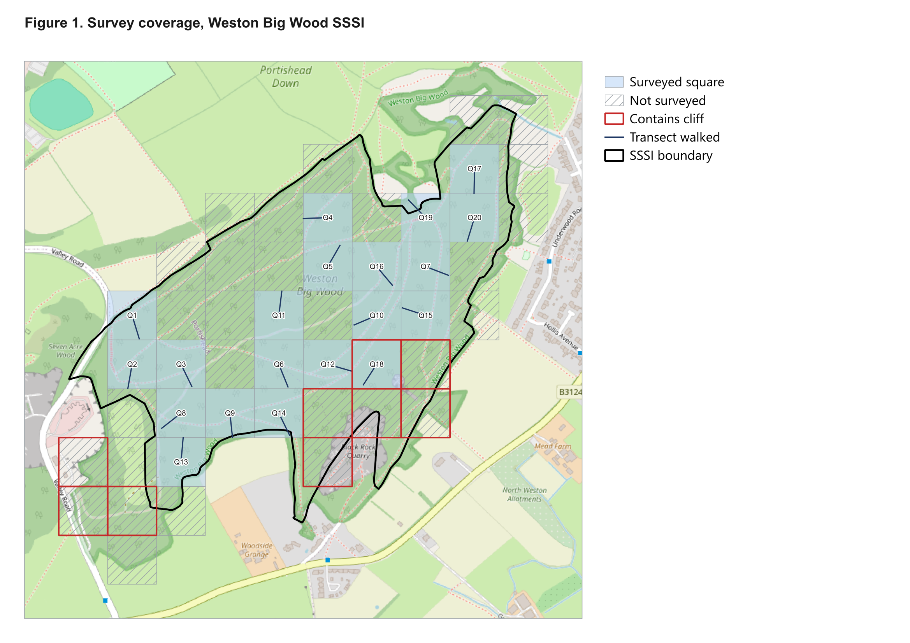

### Figure 2. Survey coverage, plain

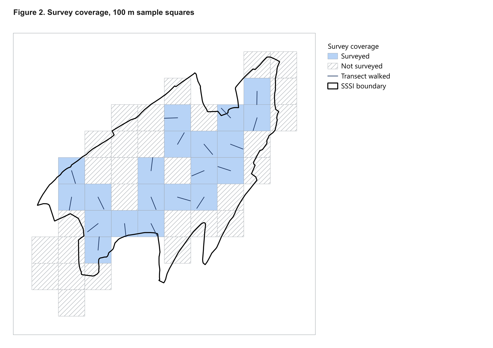

### Figure 3. Established trees per hectare

Graduated on `est_per_ha`, natural breaks. Range 450 to 1,800, site mean 988.

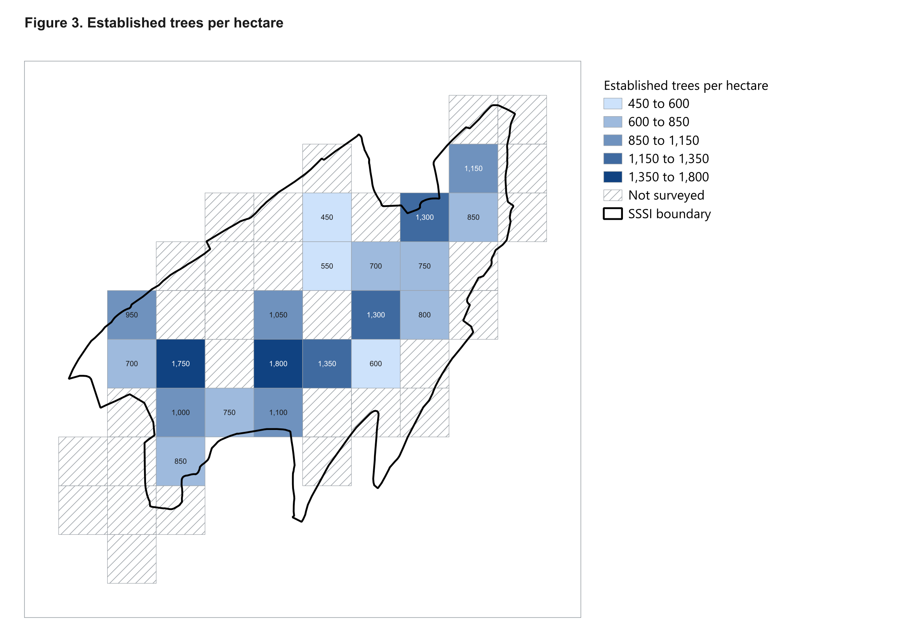

### Figure 4. Smoothed density surface

IDW interpolation clipped to the SSSI boundary. Indicative only: values
between the sample points are interpolated, not measured.

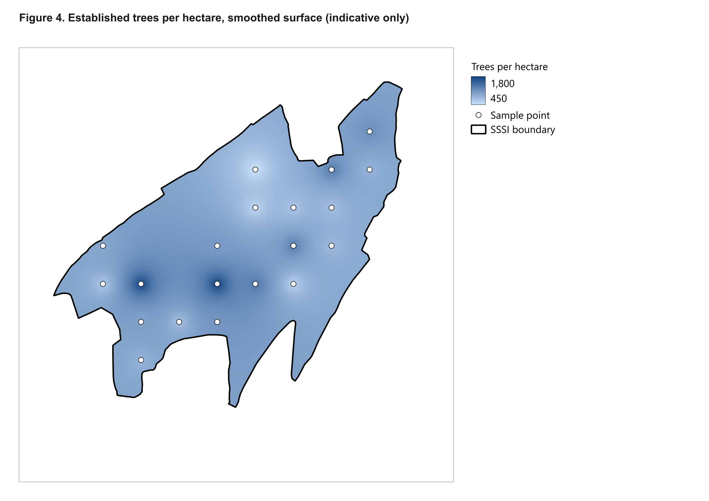

### Figure 5. Species diversity

Shannon H' on established trees, 0.66 to 1.90.

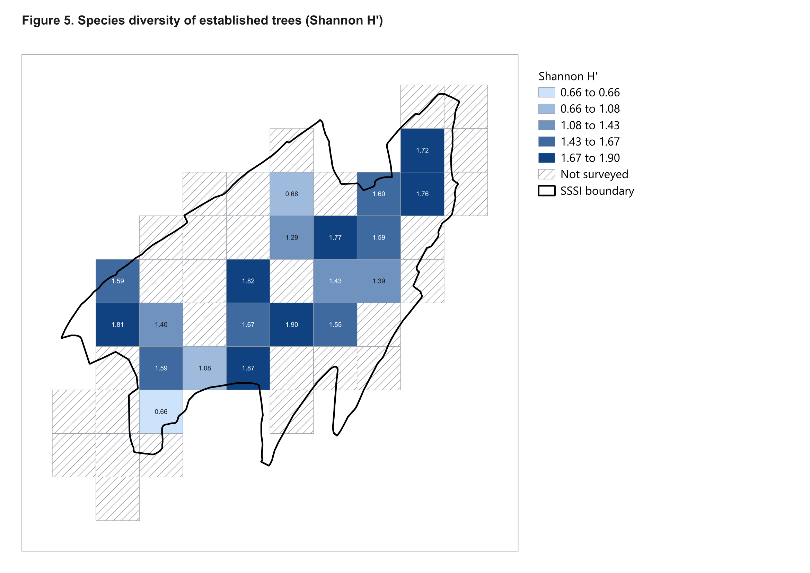

### Figure 6. Smoothed diversity surface

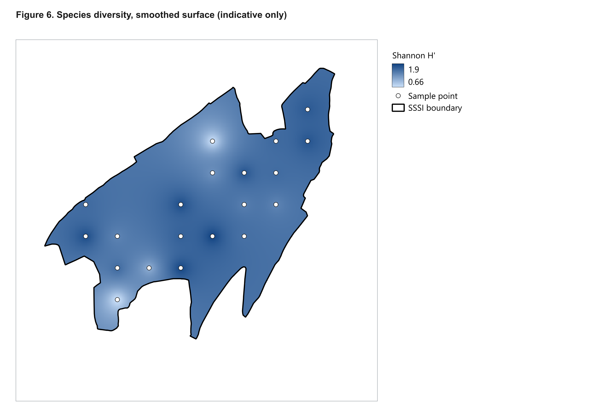

### Figure 7. Structural diversity

Size classes present out of seven. Manual classes rather than natural breaks,
because most squares hold 6 or 7 and automatic breaks flatten the map.

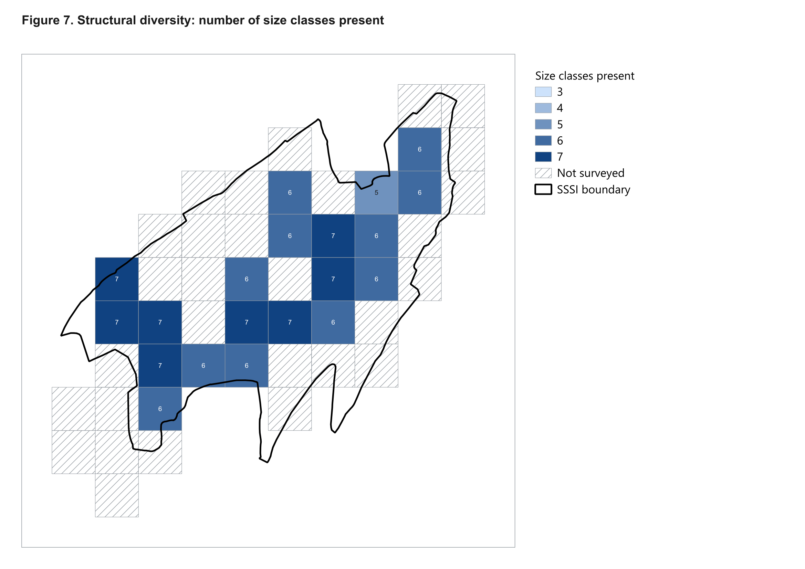

### Figure 8. Smoothed structural surface

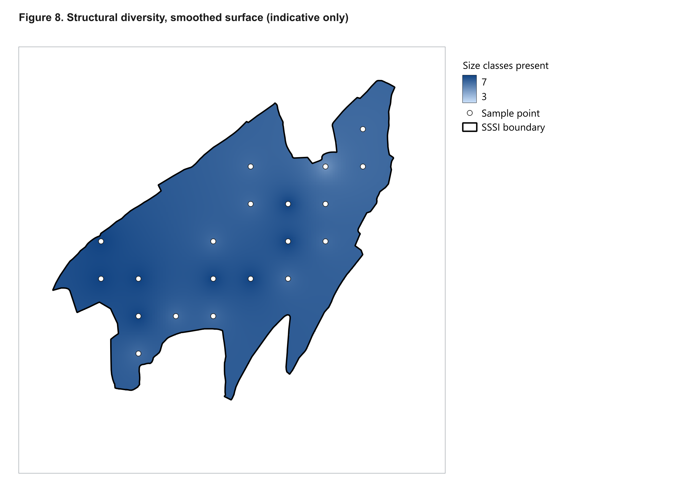

### Figure 9. Deadwood distribution

Graduated on total pieces, with the standing component marked separately.
Q1 is the only transect with no deadwood of any kind.

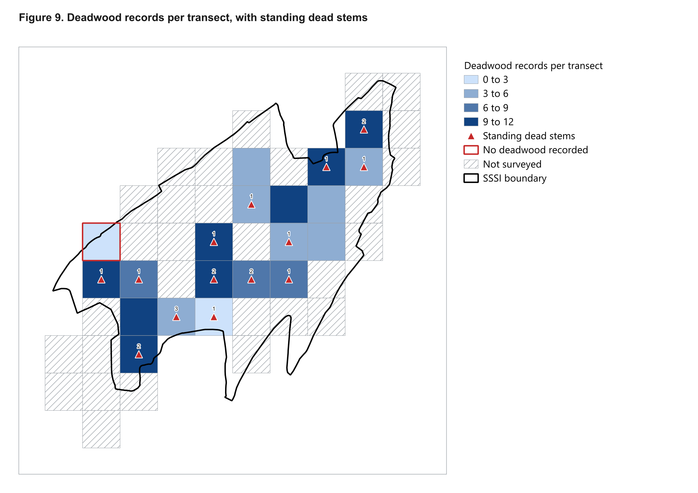

### Figure 10. Small-leaved lime and wild service tree

Graduated on established lime, with young lime and wild service marked as
points. Two wild service records only: one medium tree, and 14 seedlings
224 m away.

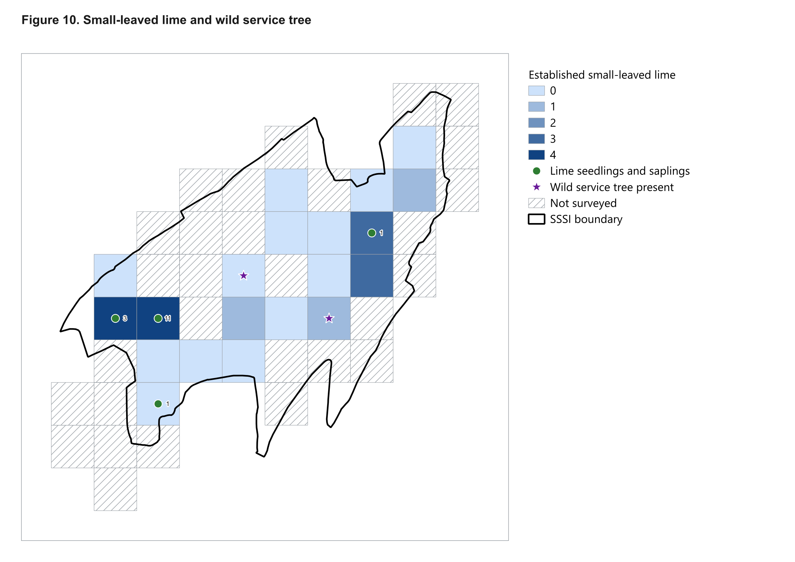

### Figure 11. Invasive and non-native trees

Drawn from `non_natives.gpkg`, which script 07 exports specifically for this,
because the `results` layer carries only a total count per square and cannot
distinguish sycamore from holm oak.

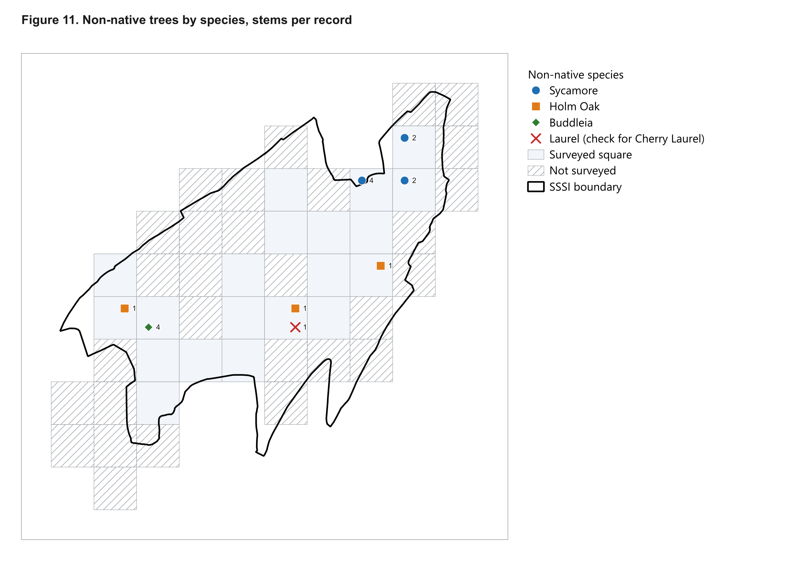

---

## A caveat on the smoothed surfaces

Figures 4, 6 and 8 use **IDW interpolation** here and **Gaussian kernel
smoothing** in the matplotlib versions. The two weight nearby points
differently, so the surfaces are related but not identical. They should never
be presented as the same figure.

Both are indicative in any case. Twenty points covering 1.06% of the site
support per-cell comparison, not a continuous surface.
